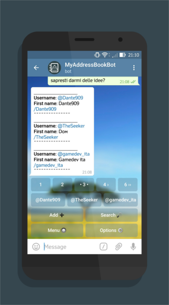

## [@MyAddressBookBot](https://telegram.me/myaddressbookbot)

MyAddressBookBot is a Telegram Bot written in php that consists in an address book of usernames for Telegram Messanger.

Telegram address book saves contacts by telephone number, but most users use the username to get in touch with people on this IM. This bot save contacts by username and let the user modify the basic info. Plus it update the username of contacts everyday so you'll never lose them.

You can also find the bot [here](https://storebot.me/bot/myaddressbookbot).

# Features
- Add contacts by forward
- Add contacts manually
- Browse the address book using a inline keyboard
- Edit contact (first name, last name, description)
- Update username automatically or manually
- Search in the address book
- Choose order of contacts (first name or lastname)
- Share using inline queries

# Current translation
- [x] English
- [x] Italian
- [x] French
- [x] Deutsch
- [x] German
- [ ] Spanish
- [ ] Portuguese
- [x] Russian
- [ ] Farsi/Persian
- [x] Hindi
- [ ] Japanese
- [ ] Chinese

# Technical
This bot uses the official Telegram Bot API(v2.1), it is based on [HadesWrapper](https://gitlab.com/WiseDragonStd/HadesWrapper) for Telegram and runs on a NGINX server hosted on a Raspberry Pi3 with php, Redis and Postgresql installed:
- Hades Wrapper is the base class that ensures velocity, reliability and php functions interfacing with Telegram Bot API.
- NGINX is used as the web server.
- php is the main language of the scripts.
- The Postgresql database is meant to save the contacts and the user that are using the bot.
- Redis is used to contains bot status and other volatile information, and it is also used as a cache containing language and contact order.

# [License](https://www.gnu.org/licenses/agpl-3.0.html)
MyAddressBookBot is released under the GNU Affero General Public License.
